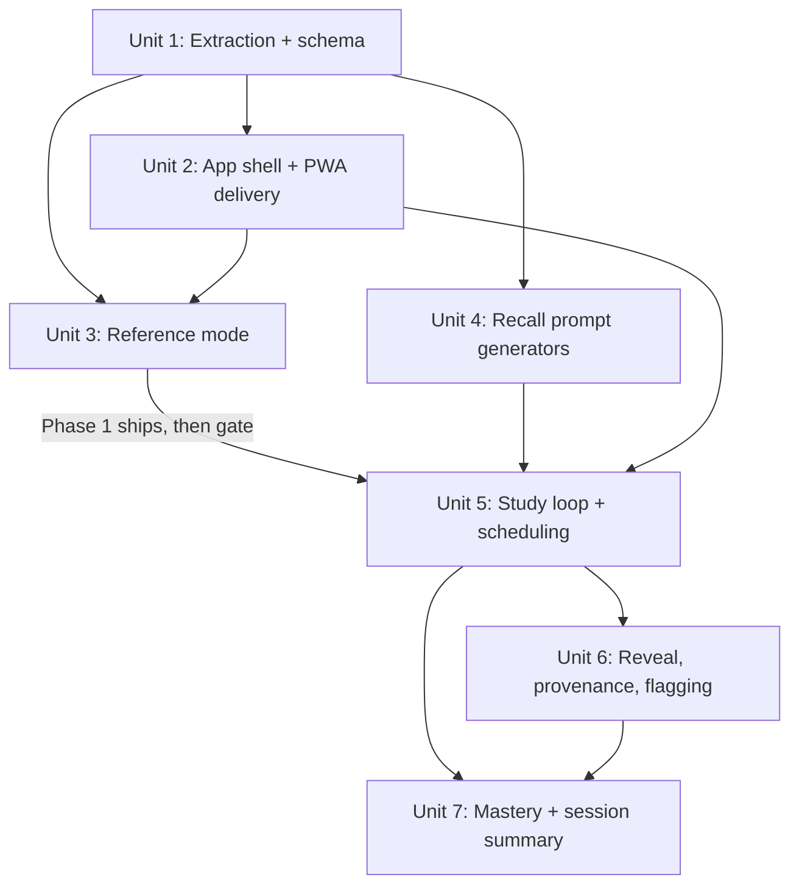

> **SUPERSEDED, 2026-07-30.** The reveal-and-rate flashcard loop was rejected in favor of the Hot Seat interrogation game plus The Daily. Units 1-3 (extraction, shell, reference) carry forward into the new plan largely intact; Units 5-7 are replaced. See the successor plan.

# Metrics Retrieval Practice — phased thin-slice build

## Overview

Build a phone-first, offline study app that turns the existing 149k-word metrics corpus into recall fluency, plus a searchable reference that stands alone. The build is deliberately phased: prove the corpus extraction and ship standalone reference value first, then prove the study loop on a small starter deck before scaling to the full corpus. This sequencing is a direct response to the document review, which established that a full 229-metric, ten-prompt-type build would produce a deck that takes 8-16 months to traverse and a premise that stays untested until months of work are sunk.

## Problem Frame

Brandon, a growth marketing consultant, wants to answer metric questions cold without hedging or reaching for a document (see origin: docs/brainstorms/2026-07-29-metrics-retrieval-practice-requirements.md). The corpus that would teach this exists but is inert prose. The gap is a retrieval-practice system. The dominant risk is not the loop design; it is adoption — every requirement describes what happens after "open app" and nothing makes a session start. The plan treats delivery and a cheap premise test as first-class, not afterthoughts.

## Requirements Trace

Carried from the origin document. IDs match the requirements doc.

- R1-R5. Self-graded reveal-and-rate loop; three-point grading with a fixed-threshold hesitation timer; no multiple choice; sub-five-minute sessions; every reveal shows provenance. → Units 5, 6.
- R6, R19-R21. Prompt types, but **v1 ships only the six recall-derivable types** (Definition, Formula, Inputs, Benchmark, Trap, Reverse). Variant, Comparison, Compute, Provenance are deferred (see Key Decisions). Extraction classifies which types each card supports, merges cross-family duplicates, recounts. → Units 2, 4.
- R7, R10. Benchmark prompts always name a segment; consumer/B2B is a prompt parameter. → Units 2, 4.
- R11-R13. Spaced repetition on the individual prompt; two mastery dimensions; configurable path defaulting family-by-family. → Units 5, 7. **Per-prompt-type mastery must feed scheduling, not just display** (review finding). → Unit 5.
- R14, R15, R22. Reference mode with real filters and disambiguating search; ships first; flag control on reveals. → Units 3, 6.
- R16-R18, R23. Side 2 (own numbers, shape-not-values, dated provenance). → **Deferred entirely to a later plan.** Schema must not preclude it (Unit 2).
- Success criteria. Usage continuity as first-order metric; a written externally-scored baseline before build; hesitation rate as supporting indicator only. → Units 7, 8, and a pre-build action below.

## Scope Boundaries

- **v1 is Phases 1-2 only.** Phase 3 (mastery surfaces) is planned but gated on the loop proving out.
- No Side 2, no data connectors, no cross-device sync, no multiplayer, no in-app authoring, no analysis/reporting.
- **No Variant / Comparison / Compute / Provenance prompt types in v1.** Their content pools are thin (Provenance ~20 items, Comparison ~4 pairs) or they break the session budget (Compute), and they need authoring rather than derivation.
- Not a rewrite of the corpus. Extraction reads `research/` as-is; corrections happen in the source markdown.

## Context & Research

Greenfield build. No existing code, no `docs/solutions/`, so the local research agent fan-out was skipped as ceremony. Grounding comes from the six-persona document review already run on the origin doc, which read the corpus files directly and verified the facts below.

### Relevant corpus reality (verified in review, not assumed)

- **226 numbered metric sections, not 229.** At least three MASTER-INDEX entries are essay findings, not metrics (e.g. Consumer Subscription entries 1-3, Growth Efficiency 2 and 18).
- **Five incompatible file schemas.** Metric headings are h1 in `research/07-b2b-pipeline-sales.md`, h2 in six files, h3 nested under `## SECTION` groupings in `research/05-engagement-activation.md`. Facet markers appear as line-start bold, bullet-prefixed bold, or h3 subheadings depending on file. `research/03a-*` and `research/03b-*` are prose supplements with no facet markers.
- **Three verification-tier vocabularies.** `[P]/[S]/[V]/[W]` in files 03/03a/03b/07/08; a distinct `[V]/[V-2nd]/[S]/[NONE]` scheme declared in `research/04-acquisition-paid-media.md`; and no tags at all (prose-only staleness notes) in files 01, 02, 05, 06 — which hold 118 of 226 sections.
- **46 sections have benchmark = "NO SOURCED BENCHMARK FOUND"** with no figure. 122 sections contain that marker somewhere.
- **At least nine metric titles appear in two families each** (ARPPU, ARPA, Burn Multiple, CAC Ratio, Cost Per Activation/Registration/Trial Start, Involuntary Churn, ARR per employee) with divergent content.
- **Name collisions are real content:** three distinct metrics called "quick ratio" (`research/03b-*`), plus bookings/billings/revenue/cash (`research/03a-*`).

### Institutional Learnings

None on disk. The superseded `tasks/game-design.md` contributes two ideas carried forward: parameterization as the anti-memorization mechanism (deferred but schema-noted), and per-prompt-type mastery feeding selection.

## Key Technical Decisions

- **Phased thin slice over full build.** Phase 1 (extraction + reference + delivery) has standalone value and proves the data. Phase 2 (loop on a starter deck) tests the premise cheaply. Only after that does the deck scale. Rationale: the review showed the full deck is untraversable and the recall-fluency premise rests on a single answered question; sinking the whole build before testing it is the exact failure to avoid.
- **Blocking prompt-production question resolved: hybrid, recall-types-only for v1.** The six recall types derive mechanically from card fields with no authoring. The four authored-heavy types are deferred. Rationale: removes a 1,400-to-2,300-item content project from the critical path and matches the stated goal (production recall), which the recall types already train.
- **Static SPA, localStorage, no backend.** Rationale: smallest thing that fully solves a single-user offline phone tool; no infra to run or secure. Framework recommendation Svelte (small, reactive, first-class PWA and static-adapter support); vanilla TS is an acceptable fallback. Confirm at implementation start.
- **PWA installed to the home screen is the delivery mechanism.** Rationale: the review's dominant risk is that a session never starts. A home-screen icon plus offline availability is the cheapest approximation of a ritual and makes the tool reachable in the dead-time moments a consultant would actually practice.
- **One unified card schema with explicit three-state benchmark.** Benchmark is `present | absent | fabricated`, not a nullable string, so "no primary source publishes this — refuse any figure" becomes first-class content rather than an empty field.
- **Scheduling is per-prompt; per-prompt-type mastery feeds selection.** A weak type gets weighted into prompt choice regardless of which metric carries it, so the second mastery dimension drives behavior instead of being a decorative chart.
- **Cross-family duplicates merge into one card with multiple family tags.** Decided before extraction because merging afterward orphans study history.

## Open Questions

### Resolved During Planning

- *How are prompts produced?* → Hybrid; six recall types derived from card fields in v1, four authored types deferred. (Was the blocking question.)
- *Consumer vs B2B — mode or parameter?* → Prompt parameter. A card carries `applies_to`; benchmark prompts name a segment; when only one context has a sourced benchmark, the other context's prompt is simply not generated for that card.
- *What tests the premise?* → Phase 1 reference-mode usage logging during real client work, plus a written baseline taken before Phase 2. If lookups are rare or reference alone suffices, Phase 2 is reconsidered before it is built.

### Deferred to Implementation

- Exact framework (Svelte vs vanilla TS) and build tool — confirm at Unit 2 start; does not change the plan shape.
- Leitner interval constants (proposed 1/3/7/16/35 days) — tune once real review load is visible.
- Manual verification-tier pass for the 118 untagged sections — the extraction (Unit 1) flags them `tier: untagged`; the human tiering pass is a content task run against the review report, not code.
- Search implementation (full-text vs name+alias) — decide at Unit 3 against real lookup feel; start with name+alias+disambiguation.
- New-vs-review session weighting — tune at Unit 5.

## High-Level Technical Design

> *This illustrates the intended approach and is directional guidance for review, not implementation specification. The implementing agent should treat it as context, not code to reproduce.*

Card schema (shape, not final field names):

```
Card {
  id, name, aka[], families[],            // families[] — merged duplicates carry >1
  applies_to,                             // consumer | b2b | both (+ free-text nuance preserved)
  is_metric,                              // false for essay/finding entries -> excluded from Formula/Compute/Benchmark/Reverse
  definition, formula_variants[], inputs[], application, traps[],
  benchmarks: { state: present|absent|fabricated, rows: [{segment, value, source, date, tier}] },
  supported_prompt_types[],               // computed at extraction from which facets are present
  related[]
}
Prompt { id, card_id, type, context, question, answer, provenance }   // generated, one per (card, type, context)
Progress { prompt_id, box, due_date, last_rating, history[] }         // localStorage, per-prompt Leitner
```

Data flow:

```
research/*.md ──(Unit 1: per-file adapters + normalizer)──> cards.json + extraction-report.md
cards.json ──(Unit 3)──> Reference mode (browse/search/filter)
cards.json ──(Unit 4: recall-type generators)──> prompts.json (starter deck subset)
prompts.json + Progress(localStorage) ──(Units 5-6)──> Study loop ──> Progress, Mastery
```

## Implementation Units



Phase 1 = Units 1-3 (ship, use standalone). Phase 2 = Units 4-6 (gated on Phase 1 use + written baseline). Phase 3 = Unit 7.

- [ ] **Unit 1: Corpus extraction pipeline and card schema**

**Goal:** Convert the ten `research/` files into one validated `cards.json` plus a human-readable extraction report, resolving every corpus irregularity the review found.

**Requirements:** R19, R20, R21, R5 (provenance preservation), R7/R10 groundwork.

**Dependencies:** None. Foundational.

**Files:**
- Create: `scripts/extract/` (per-file adapters, one per source schema), `scripts/extract/normalize.*`, `data/cards.json`, `data/extraction-report.md`
- Test: `scripts/extract/__tests__/`

**Approach:**
- One adapter per distinct file schema (h1 / h2 / h3-nested / prose-supplement), each emitting a common intermediate record. A normalizer then merges, dedupes, classifies, and validates.
- Map the three tier vocabularies onto one enum; sections with no tag get `tier: untagged` and are listed in the report for the manual tiering pass (not invented).
- Benchmark facet becomes the three-state object; "NO SOURCED BENCHMARK FOUND" → `state: absent`; identified fabrications → `state: fabricated`.
- Cross-family duplicate titles collapse to one card with `families[]`.
- Essay/finding entries get `is_metric: false` and a restricted `supported_prompt_types`.
- Emit `extraction-report.md`: final metric count, per-family counts, untagged-tier list, absent-benchmark list, merged-duplicate list, per-type derivable-prompt inventory.

**Execution note:** Start with a failing test asserting the completeness invariant (every parsed section maps to a card; counts reconcile) before writing adapters.

**Patterns to follow:** None in-repo (greenfield). Keep adapters pure and data-in/data-out for testability.

**Test scenarios:**
- Happy path: a known h2-schema metric (Net Revenue Retention) extracts all six facets with benchmark rows carrying source/date/tier.
- Edge case: an h3-nested metric from `research/05-engagement-activation.md` extracts correctly under `## SECTION` grouping.
- Edge case: an essay entry (Consumer Subscription "App store take rate changes every downstream number") is tagged `is_metric: false` and excludes Formula/Compute/Benchmark/Reverse from `supported_prompt_types`.
- Edge case: a cross-family duplicate (Burn Multiple) yields one card with two family tags, not two cards.
- Edge case: a metric with "NO SOURCED BENCHMARK FOUND" yields `benchmarks.state: absent` with zero rows.
- Edge case: an untagged-tier section (from files 01/02/05/06) yields `tier: untagged` and appears in the report list.
- Error path: a section missing an expected facet is reported as incomplete rather than silently emitting a partial card.
- Integration: total emitted metric-card count reconciles with the report's per-family sum, and equals the recount (expected ~217 after merges, exact number is the output).

**Verification:** `cards.json` validates against the schema; `extraction-report.md` lists real counts; no card has an invented benchmark or tier; spot-check of five cards against source markdown matches.

- [ ] **Unit 2: App shell and PWA delivery**

**Goal:** A static single-page app that loads `cards.json`, installs to a phone home screen, and works offline.

**Requirements:** Delivery (review's top adoption risk); foundation for R14 and the loop.

**Dependencies:** Unit 1 (needs `cards.json` shape).

**Files:**
- Create: app scaffold (`index.html`, app entry, router, service worker, web app manifest), `public/icons/`
- Test: shell smoke test

**Approach:**
- Static SPA (Svelte recommended). Client-side routing between Reference and (later) Study. localStorage as the only persistence.
- Service worker caches app shell and `cards.json` for offline use. Web app manifest with icons so "Add to Home Screen" gives a real icon.
- Landing surface: opens to Reference in Phase 1; after the loop ships, opens to a resume-or-choose surface.

**Execution note:** Execution target: external-delegate (pure scaffolding).

**Test scenarios:**
- Happy path: app loads `cards.json` and renders the landing surface on mobile viewport.
- Edge case: offline load (service worker) succeeds after first visit.
- Integration: manifest + service worker produce an installable PWA (Lighthouse installability check passes).

**Verification:** Installs to an iPhone home screen, launches offline, opens to Reference.

- [ ] **Unit 3: Reference mode** *(Phase 1 ships here)*

**Goal:** Browse, search, and filter all cards with a phone-legible card layout. Standalone-useful with zero study history.

**Requirements:** R14, R15.

**Dependencies:** Units 1, 2.

**Files:**
- Create: reference views (list, filters, card detail), search index, lookup-logging hook
- Test: reference view + search tests

**Approach:**
- Filters: family (8), context (consumer/B2B/both), verification tier, fabricated flag.
- Search over name + aliases/abbreviations; a name mapping to multiple metrics (quick ratio) returns a disambiguation list, not one card.
- Card detail is collapsible with definition + primary formula above the fold; other facets are expandable sections. Arriving from a future study prompt opens expanded at the tested facet.
- Log which cards are opened during real use (local only) — this is the Phase 1 premise experiment.

**Test scenarios:**
- Happy path: filtering to "B2B + tier P" returns only matching cards.
- Edge case: searching "quick ratio" returns a disambiguation list of all three.
- Edge case: a card whose benchmark state is `absent` renders "no primary source publishes this" rather than an empty field.
- Edge case: a `fabricated` benchmark renders with its warning, not as fact.
- Integration: opening a card writes a lookup-log entry.

**Verification:** Every card reachable by browse and by search; collisions disambiguate; usable one-handed on a phone; lookup log accumulates.

- [ ] **Unit 4: Recall-type prompt generators**

**Goal:** Generate the six recall-type prompts from cards, producing a starter deck (not the full corpus).

**Requirements:** R6 (recall subset), R7, R9-groundwork, R21.

**Dependencies:** Unit 1.

**Files:**
- Create: `scripts/prompts/` generators (Definition, Formula, Inputs, Benchmark, Trap, Reverse), `data/prompts.json`
- Test: `scripts/prompts/__tests__/`

**Approach:**
- One generator per recall type, consuming `supported_prompt_types` so essay cards and absent-benchmark cards are skipped appropriately.
- Benchmark generator emits one prompt per (card, segment) so every benchmark prompt names its segment; skips `absent`-state benchmarks.
- Starter deck = a curated subset (proposed: Retention & Churn + Unit Economics, ~2 families) so Phase 2 tests the loop without the untraversable full deck. Full-corpus generation is the same code with a wider input set — scaling is data, not code.
- Schema carries a `parameterizable` hint for later anti-memorization work (deferred).

**Test scenarios:**
- Happy path: a metric with a segmented benchmark yields one Benchmark prompt per segment, each naming the segment.
- Edge case: an essay card yields Definition/Trap only (no Formula/Benchmark/Reverse).
- Edge case: an `absent`-benchmark card yields no Benchmark prompt.
- Edge case: a `both`-context metric with only a B2B benchmark yields no consumer-context Benchmark prompt.
- Integration: starter-deck prompt count matches the report's derivable inventory for the included families.

**Verification:** `prompts.json` contains only answerable prompts; no unsegmented benchmark prompt exists; counts reconcile with the extraction report.

- [ ] **Unit 5: Study loop, self-grade, and Leitner scheduling**

**Goal:** The reveal-and-rate loop with timer-based hesitation, per-prompt Leitner scheduling, and per-prompt-type mastery feeding selection.

**Requirements:** R1-R4, R11-R13.

**Dependencies:** Units 2, 4.

**Files:**
- Create: session engine, scheduler (Leitner), progress store (localStorage), session lifecycle states
- Test: scheduler + session tests

**Approach:**
- Three-point rating; a timer starts on prompt display and any recall past a fixed threshold (default 5s, constant once set) is recorded hesitated regardless of felt confidence; elapsed time stored alongside rating.
- Leitner boxes (proposed 1/3/7/16/35 days); instant promotes, hesitated holds, blanked demotes and requeues same session.
- Selection weights in the user's weakest prompt types (the second mastery dimension acting on behavior).
- Lifecycle states: first-run (no history), fewer-due-than-target, interrupted/resumed, abandoned. Ratings commit per card.

**Execution note:** Implement the scheduler test-first — it is the piece most likely to be subtly wrong and hardest to eyeball.

**Test scenarios:**
- Happy path: instant rating promotes a prompt one box and lengthens its interval.
- Happy path: blanked rating demotes to box 1 and requeues within the same session.
- Edge case: recall past the 5s threshold records hesitated even if the user would have said instant.
- Edge case: first run with no history selects a sensible new-item set, not an empty or all-random screen.
- Edge case: a day with fewer due prompts than target ends short rather than inventing reviews (or pulls new per the tuned weighting — behavior stated, not left implicit).
- Edge case: an interrupted session resumes at the pending card with its rating uncommitted.
- Integration: a user weak in one prompt type sees that type over-represented in subsequent selection.

**Verification:** Intervals expand and contract correctly across a simulated multi-day run; weak types resurface; no lost or double-counted ratings across interruption.

- [ ] **Unit 6: Reveal interaction, provenance, and flagging**

**Goal:** The reveal step done right on touch — deliberate reveal, provenance on every benchmark answer, a link into the reference card, and a flag control.

**Requirements:** R5, R22; peek-resistance (review finding).

**Dependencies:** Unit 5.

**Files:**
- Create: reveal component, provenance renderer, flag-queue store
- Test: reveal + flag tests

**Approach:**
- Reveal fires from a dedicated thumb-zone button, not tap-anywhere; rating controls are inert until reveal.
- Benchmark answers render source + date + tier; `fabricated` answers render as fabricated.
- Every revealed answer links into its full reference card (opens expanded at the tested facet) and returns to the pending rating.
- Flag control writes prompt id + metric + optional note to a local review queue; never edits content.

**Test scenarios:**
- Happy path: rating controls are disabled until Reveal is pressed.
- Edge case: a long provenance answer keeps the rating controls reachable (no below-fold trap).
- Edge case: flagging writes a queue entry and does not mutate the card.
- Integration: following the card link and returning preserves the pending rating.

**Verification:** No accidental reveals in one-handed use; provenance always present; flag queue accumulates and is exportable as a list.

- [ ] **Unit 7: Mastery and session summary** *(Phase 3, gated)*

**Goal:** Feedback surfaces that answer a question rather than render generic dashboards.

**Requirements:** R12; success-criteria surfacing.

**Dependencies:** Units 5, 6.

**Files:**
- Create: mastery view (per-prompt-type primary, per-family rollup), session summary
- Test: mastery aggregation tests

**Approach:**
- Primary mastery view is the ten prompt types (fits a phone, this is where blind spots live). Metrics roll up to the eight families with drill-down, not a flat 226-cell grid.
- Session summary leads with hesitation rate and its direction vs recent sessions, names the items returning soonest, and shows usage-continuity progress against the 30-sessions-in-60-days target.
- Surface objective-vs-self-rating divergence where derivable (Reverse prompts are objectively checkable), as an honesty check on self-grading.

**Test scenarios:**
- Happy path: completing a session updates both mastery dimensions and the summary.
- Edge case: early state (mostly empty deck) renders an honest "not enough data yet" rather than misleading fullness.
- Integration: per-prompt-type mastery shown here matches the weighting the scheduler acts on.

**Verification:** Blind spots are visible at a glance; summary leads with hesitation rate; continuity target is tracked.

## System-Wide Impact

- **Interaction graph:** Reference and Study share `cards.json` and the card-detail component; a change to the card schema touches extraction, reference, and prompt generation together.
- **Error propagation:** Extraction failures must surface as report entries, not silent partial cards — a silently dropped facet becomes a wrong or missing prompt drilled to fluency.
- **State lifecycle risks:** localStorage is the single source of progress truth; interruption mid-session and schema changes to stored progress need migration handling (versioned progress store).
- **API surface parity:** none (no backend, single client).
- **Integration coverage:** the extraction completeness invariant and the scheduler's multi-day behavior are the two things unit-level mocks won't prove; both get integration-level tests.
- **Unchanged invariants:** the `research/` markdown is the source of record and is not modified by the app; corrections flow through it.

## Risks & Dependencies

| Risk | Mitigation |
|------|------------|
| Wrong benchmark drilled to fluency (corpus error surfaces in study) | Provenance on every answer (R5); flag control (Unit 6); untagged/absent states explicit, never invented; written baseline scored against source |
| Deck never traversed / premise untested | Phased build; Phase 1 ships standalone; starter-deck-only loop; usage-continuity as first-order success metric with a day-60 checkpoint |
| Session never starts (adoption) | PWA on home screen + offline; Phase 1 reference has independent daily utility during client work |
| Self-grading inflation invalidates the headline metric | Hesitation demoted from headline to supporting; written external baseline is the real measure; objective-vs-self divergence surfaced (Unit 7) |
| Extraction degrades the tier data (highest-risk element) | Three-state benchmark + tier enum with `untagged`; report lists every untagged/absent case for a human pass; spot-check gate before Phase 2 |
| Scope creep back toward the full 229×10 build | Four prompt types explicitly out of v1; starter deck only; scaling is data not code |

## Documentation / Operational Notes

- **Pre-build action (owner: Brandon, before Phase 2):** take the twenty-prompt written baseline, answers scored against the cards, date and time-per-answer recorded. This is the only credible success measure and cannot be reconstructed later.
- Deployment: static host (e.g. Netlify/Vercel/GitHub Pages); no secrets, no backend.
- The extraction report is the working document for the manual tier pass and duplicate review.

## Phased Delivery

### Phase 1 — Prove the data, ship standalone value
Units 1-3. Extraction + reference + PWA delivery. Use it in real client work for ~4 weeks; the lookup log and whether reference alone suffices are the premise evidence. Take the written baseline during this window.

### Phase 2 — Prove the loop (gated on Phase 1 use + baseline taken)
Units 4-6. Recall-type generators, starter deck (~2 families), study loop, scheduling, reveal/provenance/flagging. Check the day-60 usage-continuity target.

### Phase 3 — Feedback surfaces (gated on the loop being used)
Unit 7. Mastery and session summary.

### Deferred to later plans
Side 2 (own numbers); Variant/Comparison/Compute/Provenance prompt types; prompt parameterization for anti-memorization; full-corpus deck scaling; cross-device sync.

## Sources & References

- **Origin document:** [docs/brainstorms/2026-07-29-metrics-retrieval-practice-requirements.md](docs/brainstorms/2026-07-29-metrics-retrieval-practice-requirements.md)
- Superseded design (retained for reasoning): `tasks/game-design.md`
- Corpus: `research/` (10 files), `MASTER-INDEX.md`
- Prior ideation: `docs/ideation/2026-07-28-metrics-mastery-game-ideation.md`
