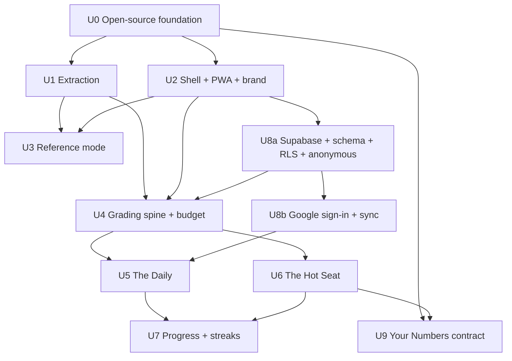

> **SUPERSEDED, 2026-07-31.** The Daily is gone, spaced repetition is gone, and
> the Hot Seat's unit of play changed from a question to a generated exchange
> between directors. What carries forward and still runs in production: the
> corpus extraction, the grading spine, the board-answer rubric, identity and the
> budget controls. See `docs/plans/2026-07-31-002-feat-the-meeting-plan.md`.

# The Hot Seat + The Daily

## Overview

Two-mode game on top of the metrics corpus (226 numbered sections, ~214 of them prompt-bearing after essays are excluded and duplicates merged), with recall fluency as objective #1:

1. **The Hot Seat** (core game): a simulated board meeting or diligence call. An LLM interrogator asks contextual metric questions, escalates follow-ups, pounces on hesitation, and occasionally plants a fabricated benchmark from the corpus as a trap. Answers are **typed**, so grading is intrinsic rather than self-reported, and latency is measured automatically.
2. **The Daily** (habit engine): one five-prompt chain per day, same seed all day, typed answers, hard stop, shareable result tile, streak. Attacks the review's #1 risk, the session that never starts.

The Daily is deliberately built first within the game phase: it is the **walking skeleton of the Hot Seat machinery** (prompt → typed answer → LLM-graded verdict → scheduling update) with none of the multi-turn complexity. Shipping it first proves the grading spine and starts the habit before the full interrogation engine lands.

Design system is the BrandonSellers.com personal brand, extracted from `~/Personal/Brandon_Sellers_Website/css/site.css`.

**This ships as an open-source, multi-tenant product, not a personal tool** (decision 2026-07-30). Three consequences that shape everything below:

1. **Anyone can play immediately, with no data and no setup.** The hosted game runs on the universal corpus. Light identity keeps a streak and a Hot Seat record across devices. This is the front door.
2. **Anyone can make it theirs by forking.** Side 2 (your own numbers) works by filling a published data contract in your fork. Brandon publishes the schema and a validator; how you populate it — by hand, by a script against your warehouse, by a BI export — is the forker's problem, deliberately. **No connectors get built for other people's stacks.**
3. **The corpus is the distributed asset.** A source-verified metrics corpus with the fabrication catalog, carrying attribution, is the thing worth forking. That is also the pipeline mechanism: growth marketers who fork it meet the research, the MICW brand, and the author — top-of-funnel for the newsletter and the consulting practice. Without that line, this is a personal study tool with an open-source hobby attached.

## Problem Frame

Unchanged from the origin doc: recall fluency, answering cold without hedging. The format pivot (Addendum 2026-07-30) replaces the self-graded flashcard loop, which Brandon rejected as "flashcards on the honor system." Typed production + machine grading + measured latency eliminate most of the honor-system surface the review flagged as the design's biggest unverified assumption.

## Requirements Trace

- Recall as the only verb; no multiple choice (strengthened: typed production). → Units 4-6.
- Measured hesitation: timer from prompt render to answer submit; fixed threshold. → Units 4-6.
- R5/R23 provenance on every reveal (source, date, tier; fabricated flagged). → Units 3, 5, 6.
- R7 benchmark prompts name a segment; R10 consumer/B2B as prompt parameter. → Units 1, 5, 6.
- R19-R21 extraction classification, duplicate merging, recount. → Unit 1.
- R11-R13 spaced repetition per prompt underneath; the scheduler picks what the interrogator asks. → Units 5, 6.
- R14/R15/R22 reference mode first, disambiguating search, flag control. → Unit 3.
- Success criteria: usage continuity (30 sessions / 60 days), written baseline before the game phase, hesitation rate as supporting metric. Unchanged.
- Side 2 (own numbers, shape not values): deferred, schema must not preclude. Unchanged.

## Scope Boundaries

- No voice input in v1 (typed only; voice is the natural v2 for Hot Seat).
- No multiplayer, leaderboards, teams, orgs, or roles. Sharing is the Daily result tile only (a text/image snippet, no data).
- No in-app authoring; corpus corrections flow through `research/` and land via pull request.
- **No data connectors, for anyone, ever — including Brandon.** Side 2 is a contract you fill, not an integration anyone builds. This is the load-bearing scope boundary of the whole open-source model.
- No billing, plans, or paid tiers in v1. Cost is controlled by caps and bring-your-own-key (see Cost model).
- No admin dashboard, user management UI, or analytics beyond what a single operator needs to see the service is alive.
- The four authored-heavy prompt dimensions from the superseded plan (Variant/Comparison/Compute) are not separate types anymore; the interrogator naturally reaches them as follow-ups. Fabricated-benchmark traps ARE in scope, as Hot Seat content.

## Distribution, Identity & Multi-tenancy

### Two ways to run it

| | **Hosted** (the front door) | **Forked** (make it yours) |
|---|---|---|
| Who | Anyone, zero setup | Someone who wants Side 2 on their own numbers |
| Content | Universal corpus only | Universal corpus + their `your-numbers` file |
| Identity | Anonymous, upgradeable via Google sign-in | Their own Supabase project, or anonymous-only |
| API cost | Free tier with a daily cap; bring-your-own-key to lift it | Their key, their bill |
| Data | Their progress rows, isolated by row-level security | Never leaves their infrastructure |

### Identity: anonymous first, then Google — and nothing else

No signup wall — that would kill the front door. A first-time player gets an anonymous local identity and can play the Daily immediately. Signing in does exactly one thing: **moves the streak, Leitner state, and Hot Seat record off the device and into an account** so they survive a new phone. That is the entire value proposition of the account and should be stated that plainly in the UI.

**Google sign-in only** (decision 2026-07-30). No passwords, no magic links, no GitHub, no email/password fallback. The reasoning is that every alternative adds a support surface for a solo maintainer — password resets, deliverability problems, account-recovery requests — in exchange for reaching a marginal slice of users. Google is one button, near-universal among the target audience, and carries no credential storage obligation whatsoever: no password hashes exist to leak, because none are ever created.

Accepted trade-offs, stated so nobody rediscovers them as bugs: someone without a Google account can still play indefinitely, just anonymously on one device, and losing access to the Google account means losing the streak. Both are acceptable for a free practice game. If a second provider is ever added it should be because real players asked, not on speculation.

Supabase for auth and Postgres, chosen because it is itself open source and self-hostable: a forker points at their own project and owns every row. Firebase or a proprietary auth vendor would break the fork story. Multi-tenancy is enforced by row-level security on `user_id`, not by application code — the isolation boundary is in the database, where it cannot be forgotten in a handler.

### The data contract (the product boundary)

Side 2 is enabled by a published JSON schema, `schemas/your-numbers.schema.json`, holding **shape facts only** per the origin doc's R16/R17: order of magnitude, direction of travel, position relative to benchmark, and a mandatory `as_of` date per fact. The app validates on load, refuses malformed files, and suspends any fact older than one reporting period from questioning rather than asking about it.

Populating that file is explicitly the forker's job. Ship a filled `examples/your-numbers.example.json` and a `docs/YOUR-DATA.md` that shows three ways people actually do it (hand-edited, a script against a warehouse, a BI export), and stop there. **The moment this repo contains a Salesforce or Stripe connector, Brandon owns every other stack's integration too.**

### How big the game actually is

| | Count |
|---|---|
| Prompt-bearing metric cards (after merging duplicates, excluding essays) | ~214 |
| Single-facet questions (definition, formula, inputs, application, benchmark, traps) | ~1,194 |
| Comparison questions from documented confusion pairs | ~24 |
| Provenance questions from the fabrication catalogue | ~22 |
| **Distinct question pool** | **~1,240** |

At the Daily's five per day, seeing every question once takes **eight months**; mastering every question through the Leitner boxes takes **about three and a half years**. There is no "end" to reach at that pace — the corpus is deliberately deeper than any single playthrough. That reframes the free-tier question: the constraint was never a player exhausting the content, it was a script hammering the endpoint.

### Cost model — free forever, cut it off if it ever hurts

**The model is configuration, not architecture** (decision 2026-07-30). Both LLM calls — interrogation and grading — go through a thin adapter so the provider and model are environment values. Every candidate below is affordable, so the choice gets made on *voice and grading accuracy*, evidence from a bake-off, not on price. It also means a pricing change from either vendor is a config edit, and a forker can point at whatever they already pay for.

**Prompt caching** does the heavy lifting on every option: system prompt, rubric, and card facets are stable and cached, so repeat reads bill at a fraction. Only the question and the player's typed answer are fresh tokens.

> **Correction, 2026-07-30:** earlier figures in this plan omitted **reasoning tokens**, which bill as output on the GPT-5.6 family. Every number below includes them. The corrected working default is ~$912 per thousand players per year, not the ~$532 previously stated.

**Effort is a bigger cost lever than model choice.** Same models, same volumes, varying only reasoning effort:

| Effort (both jobs) | Grade/answer | Session | Player/year | 1,000 signups/yr |
|---|---|---|---|---|
| **low ← recommended** | **$0.0005** | **$0.13** | **$14.88** | **~$912** |
| medium | $0.0014 | $0.30 | $33.78 | ~$2,071 |
| high | $0.0039 | $0.82 | $92.37 | ~$5,663 |

A 6× swing from one setting. And the two jobs are not equally sensitive — holding the other at low:

| | Grading at this effort | Interrogation at this effort |
|---|---|---|
| low | $912 | $912 |
| medium | $1,039 | $1,944 |
| high | $1,421 | $5,155 |

**Interrogation effort is the dominant cost driver in the whole system** (six turns a session, expensive model). Grading effort barely moves the needle even though grading is 95% of calls, because each call is tiny.

Model comparison at low effort, interrogation on Sol:

| Grader | Cost/answer | Player/year | 1,000 signups/yr |
|---|---|---|---|
| **Luna ← default** | **$0.0005** | **$14.88** | **~$912** |
| Terra | $0.0053 | $26.65 | ~$1,640 |
| Sol | $0.0134 | $46.27 | ~$2,852 |

List prices: Luna $0.20/$1.20, Terra $2/$12, Sol $5/$30 per MTok. Several GPT-5.6 models carry a further 50% discount that would halve these.

### Hitting a $1,000–1,500 ceiling per 1,000 users

**The Daily is free and the Hot Seat is the entire bill.** Grading every Daily answer for all 1,000 users for a full year costs **$66**. One Hot Seat session costs $0.13. So the budget, restated in the only currency that matters:

> **$1,500 buys roughly 9,000 Hot Seat sessions a year per 1,000 signups.**

Candidate mixes, at the assumed engagement (700 bounce, 250 dabble, 50 heavy players doing a Daily most days and two sessions a week):

| Mix | Per 1,000/yr | |
|---|---|---|
| A — Sol-low interrogate / Luna-low grade everywhere | $1,016 | baseline |
| **C — A, plus the trap turn on Sol-medium ← recommended** | **$1,207** | $293 spare |
| B — A, plus Hot Seat grading on Terra-low | $1,220 | |
| D — B and C together | $1,412 | only $88 spare |
| E — all grading on Terra | $1,819 | over |
| F — all interrogation on Sol-medium | $2,165 | over |

What each upgrade costs from baseline: trap turn to medium **+$192**, Hot Seat grading to Terra **+$205**, Daily grading to Terra **+$599**, all interrogation to medium **+$1,150**.

**Recommendation: Mix C.** Upgrade exactly one turn — the trap, the dramatic peak the whole session builds toward — and leave everything else at low. It buys the moment players remember for $192 and keeps $293 of headroom. Mix D is better on paper and too tight in practice, for the reason below.

### The ceiling is not set by the model mix

| Heavy users per 1,000 | Cost at Mix D |
|---|---|
| 25 | $918 |
| 50 (assumed) | $1,412 |
| 100 | $2,400 |
| 200 | $4,375 |

Model choice moves the total by a few hundred dollars. **Engagement moves it by thousands.** If the game works better than expected, success is what breaks the budget — and no amount of model tuning prevents that. So the ceiling has to be enforced, not estimated:

- **The Daily stays uncapped and unlimited.** At $66 a year for everybody it is not worth metering, and it is the habit engine.
- **Hot Seat gets a per-user cap of ~2 sessions a week.** Generous enough that no ordinary player ever notices, and it bounds the worst case per person. Under it, 100 heavy users still lands near $1,082 rather than $2,400.
- **A global session ceiling is the hard guarantee**, expressed in sessions per day rather than dollars so it is legible at a glance. That is the same circuit breaker already in this plan, restated in the unit that actually drives cost.

Spend the headroom on absorbing engagement upside, not on more model quality.

### The two settings, decided

**`gpt-5.6-sol` interrogating at `low` effort; `gpt-5.6-luna` grading at `low` effort.** That baseline is ~$912 per thousand players per year on the raw per-call arithmetic above, and $1,016 once real engagement mix is applied (Mix A in the table below). The shipped configuration is **Mix C**, which is this baseline plus the single trap turn raised to `medium`, at ~$1,207. Everything in this section describes the baseline; the trap-turn exception is the only departure from it.

**Why low effort on grading:** the job is matching a typed answer against facets already supplied in the prompt. That is recall and comparison, not reasoning — extended deliberation has nothing to chew on and adds only cost. Note Luna *defaults* to medium, so this must be set explicitly rather than left alone.

**Why low effort on interrogation, which is the non-obvious one:** cost is the smaller reason. The real one is **latency**. The Hot Seat measures how long a player hesitates before typing, and reveals questions through a typewriter. If the model spends eight seconds reasoning before the first character appears, the pacing dies and the hesitation measurement is swamped by wait time. A board member who pauses to think for ten seconds before every question is not a more intimidating board member. Sol already defaults to `low`, which is the correct setting here for reasons that have nothing to do with the bill.

Escalating effort is a per-scenario lever if a bake-off transcript is genuinely flat — but try a better prompt first, since prompt quality moves persona more reliably than reasoning depth does.

### On Sol → Terra for grading

It is available and it is the wrong place to spend. Terra grading costs **$1,640 versus Luna's $912** — an extra $728 a year per thousand players to upgrade the *easy*, *high-volume*, *mechanical* job. If quality money is going anywhere it belongs on interrogation, which is what players actually judge.

The honest test is the Unit 4 hand-checked gate: if Luna at low effort matches every human verdict on the fixture set, there is no case for paying ten times more. If it misses hedged or partially-correct answers, move grading to Terra and accept the $728. Decide it on the fixture, not in advance.

### Model bake-off (do this in Unit 6, before committing)

**The bake-off matrix is model × effort, not model alone** — effort swings cost 6× and latency more than that, so a model tested at the wrong effort tells you nothing useful.

Two jobs with different requirements, and the default already splits them:

- **Grading** — structured comparison against facts already in the prompt. 95% of calls, ~6% of cost. Default **`gpt-5.6-luna` at `low`**, gated on the Unit 4 fixture.
- **Interrogation** — character, escalation, timing, trap placement. What players judge the product by, and the dominant cost. Default **`gpt-5.6-sol` at `low`**, chosen as much for response latency as for price.

Run candidates against the same three showcase turns already scripted in the mock (NRR definition, benchmark-counter trap, churn annualization). Judge blind on: does it hold the persona across turns, escalate credibly when an answer is thin, and plant the trap without telegraphing it? **Record time-to-first-token alongside the transcript** — a configuration that reads beautifully but takes six seconds to start is disqualified, because it breaks the hesitation measurement the whole design rests on.

Decision rules set in advance: if Terra at low is indistinguishable from Sol at low in blind transcripts, take Terra and save ~$670 per thousand players. If Sol at low reads flat, try a stronger prompt before raising effort — prompt quality moves persona more reliably than reasoning depth, and costs nothing at runtime. Keep transcripts and latencies in the repo as the evidence for whatever gets chosen.

**Prerequisite if OpenAI wins:** the Codex CLI on this machine authenticates through a ChatGPT account, which is not API access — a server-side app needs a separate OpenAI API key with per-token billing. Confirm that account exists before the bake-off, or the winning model can't ship.

**Everyone plays the entire game free, with no paywall and no key requirement.** Four controls, in the order they bind:

1. **Hot Seat cap: ~2 sessions per user per week.** The primary budget control, because sessions are effectively the whole bill. Set generously enough that ordinary play never touches it.
2. **The Daily is uncapped**, deliberately. $66 a year for a thousand users is not worth metering, and it is the habit engine.
3. **Rate limit** — ~60 graded answers per hour per identity. Aimed at scripts, not players.
4. **Global session ceiling per day** as the circuit breaker and the hard guarantee. On trip the game degrades to a stated "the grader is resting, back tomorrow" while reference mode keeps working. **This is the cut-off switch** — one config value, no code change, no data loss. Express it in sessions rather than dollars so it reads at a glance.

**Bring your own key** survives as an *option* for self-hosters and anyone wanting past the caps, never as a gate.

If spend gets uncomfortable, tighten the Hot Seat cap first. Do not touch the Daily.

## Context & Research

### Corpus reality (verified in review; carried forward)

226 numbered sections across ten files with five incompatible schemas, three verification-tier vocabularies (118 sections untagged), 46 benchmark-absent sections, at least nine cross-family duplicate titles, ~20-25 identified fabricated benchmarks, and two prose supplements (03a bookings/ACV/TCV, 03b quick-ratio collision) that become interrogation content.

### Brand system (BrandonSellers.com)

| Token | Value |
|---|---|
| Background / card / border | `#FAFAF8` / `#FFFFFF` / `#E8E6E1` |
| Text / mid / muted / faint | `#1A1A1A` / `#4A4A4A` / `#6A6A6A` / `#A0A0A0` |
| Accent | `#3D63DD` → `#7C3AED` gradient (135deg); blue for interactive, gradient for primary CTAs |
| Semantic | emerald `#059669`, amber `#D97706`, red `#DC2626` |
| Type | DM Sans (body/headings, tight tracking on display sizes) + JetBrains Mono (eyebrows, tags, numbers, formulas; uppercase 0.1-0.14em tracking) |
| Components | 14px-radius cards, uppercase mono tag pills, gradient buttons with blue shadow, frosted nav |

Dark theme: derive from the brand (deep warm-black ground, same accent hues lifted for contrast); the site is light-only, so dark is an extension, not a port.

### API integration (provider-agnostic)

Requirements the adapter must satisfy on whichever provider wins the bake-off:

- **Structured output for verdicts** — a JSON schema the model must conform to, so the client never parses free text. Both families support this (`output_config.format` on Claude; structured outputs on GPT-5.6).
- **Prompt caching on the stable prefix** — scenario system prompt, rubric, and card facets. This is what makes per-exchange cost collapse to the short new turns on either provider.
- **Streaming** for interrogator text, since the typewriter reveal is part of the feel.
- **Reasoning effort set explicitly on every call, `low` on both jobs by default.** Never rely on the model's own default — they differ per model. Both families expose the control (`output_config.effort` on Claude; reasoning levels `low` through `max`/`ultra` on GPT-5.6).
- **Refusal / safety-stop branch** handled before reading content, on either provider.
- **Key security:** the provider key lives in a Netlify Function environment variable, marked Sensitive, and the function is the only caller. Never in a client bundle.

Provider notes worth carrying into implementation: Claude Sonnet 5 rejects non-default `temperature`/`top_p`/`top_k`, so tone is steered by prompt rather than sampling. GPT-5.6 models expose reasoning levels from `low` through `max`. Whichever is chosen, the SDK-specific detail belongs behind the adapter, not scattered through the game code.

## Key Technical Decisions

- **Score the board answer, not the trivia (mock feedback, 2026-07-30, revised same day).** Grading rules from playtesting: (1) Benchmark-challenge turns are graded on the **board-answer rubric**: *counter with your own sourced number* (you can never tell a board member "you're wrong" — you anchor a different number instead) and *bridge to strategy* (point back to the driver metrics and what we're doing about them — the biggest scoring component). Both → commanded the room. Anchor only → countered, with a nudge to bring the plan. Strategy only → "good plan, wrong map" (committed resources against an unverified number). Bare challenge or negation without an alternative → weak ("if not 118, then what? Without your own anchor, the banker's number stands"). Accepting and planning against the number → burned. (2) Questions test consensus-core definitions, not vendor construction differences; variants live in reference cards as traps, not exam material. (3) Compute-question reveals show the formula, then the formula applied step by step to the numbers in the question. The rubric renders in the reveal as a visible checklist ("The board answer") so the answer structure itself is what gets memorized. These rules go verbatim into the interrogator and grader prompts in Units 4 and 6.
- **Format: Ace Attorney-style turn-based meeting (2026-07-30).** One speaker in close-up per turn, typewriter dialogue, interjection cards, and a five-pip credibility bar (wrong −1, burned −2, zero adjourns the meeting). Board members are domain-bucketed opponents — CFO/finance, product seat/retention, growth seat/funnel — with a friendly CEO chairing. Cast and scenario packs are content, not code.

- **LLM-driven interrogator, not scripted trees.** Scripted interrogation across 226 metrics is a giant authoring project with low fidelity. The LLM gets the metric card (all six facets, provenance included) in its system prompt and interrogates against it, which also solves free-text grading and anti-memorization (surface wording varies every run) in one stroke. Trade-off accepted: Hot Seat and the Daily require network; reference mode stays offline.
- **Thin serverless proxy on Netlify, plus Supabase for identity and progress.** `/.netlify/functions/interrogate` and `/grade` hold the API key server-side and enforce the session cap, rate limit, and global ceiling; conversation state stays client-side and is passed per request, so the functions remain stateless. Supabase (Postgres + auth) holds accounts and progress. Supabase specifically because it is open source and self-hostable — a forker points at their own project and owns every row, which a proprietary auth vendor would make impossible.
- **Multi-tenancy is enforced in the database, not the app.** Row-level security on `user_id` for every progress table. Application code cannot forget it, and a forked deployment inherits the isolation for free.
- **Anonymous-first identity, Google-only sign-in.** Play with no account; sign in with Google — and only Google — solely to move progress off the device. No passwords or magic links means no credential storage, no reset flow, and no deliverability failures to support. The account's entire pitch is streak survival across devices, and the UI should say exactly that rather than implying a richer profile exists.
- **Grading is a structured verdict, not a chat reply.** The grade call returns `{verdict: correct|partial|wrong, missed: [...], tell: string}` via structured outputs, scored against the card's facets which are included in the call. The interrogator's next question is a separate concern from the verdict.
- **The Daily is deterministic; the Hot Seat is generative.** Daily prompts are picked by a date-seeded PRNG over the prompt inventory (same chain for everyone all day, no server needed for selection); only grading hits the LLM. Hot Seat sessions are generated fresh each time.
- **Latency is the honesty mechanism.** Timer runs from prompt render to answer submit. Past the threshold (default 5s Daily, scenario-dependent in Hot Seat) the answer is marked hesitated regardless of correctness. No self-rating anywhere.
- **Leitner scheduling survives underneath, invisible.** Per-prompt boxes drive which metrics the Daily draws from (weighted) and which cards the Hot Seat interrogator is briefed to probe. The game is the interface; the scheduler is the engine.
- **Provider-agnostic LLM adapter; model is config, not architecture.** One narrow interface with two methods (`interrogate`, `grade`) and an implementation per provider. The shipped configuration is GPT-5.6 (Sol interrogating, Luna grading), chosen by the Unit 6 bake-off on voice and the Unit 4 hand-checked set on grading accuracy rather than by the price sheet. The adapter exists so that stays a config value: a Claude implementation is a second file, not a refactor. This also lets a forker run whatever they already pay for.
- **Expect the two jobs to want different models *and* different efforts.** Grading is structured comparison against supplied facts and runs cheap at low effort (Luna, ~$0.0005 an answer). Interrogation is character and escalation, which is the actual product. Do not assume one setting wins both.
- **Reasoning effort is a first-class setting, defaulting to `low` on both calls.** It moves cost 6× and latency more, and the game's hesitation timer makes latency a correctness concern rather than a comfort one — a slow first token corrupts the measurement the design depends on. Effort is set explicitly on every call, never left to the model's default (Luna defaults to medium, Sol to low).
- **Budget is enforced in sessions, not dollars.** A ~2-per-week Hot Seat cap per user is the primary control (sessions are effectively the whole bill), a ~60-answers-per-hour rate limit stops scripts, and a global daily session ceiling is the hard guarantee, degrading to a stated "grader is resting" state. The Daily is uncapped by design. No paywall.
- **The data contract is the product boundary.** A published JSON schema plus a validator, and nothing else. No connectors for anyone's stack, including Brandon's — Side 2 for his own numbers uses the same contract every forker uses, which is the only way to know the contract is actually sufficient.

## High-Level Technical Design

> *Directional guidance for review, not implementation specification.*

```
CONTENT (open source, ships with the repo)
  research/*.md ──(U1 extraction)──> data/cards.json + fabrications.json
                                        │
FORKER'S OWN DATA (never in this repo)   │
  their warehouse / BI / hand-editing    │
        └──> your-numbers.json ──────────┤   validated against
             (schemas/your-numbers.       │   schemas/your-numbers.schema.json
              schema.json, as_of dated)   │
                                          ▼
APP                            ┌── Reference mode (offline, no account, no API)
                               ├── The Daily  (date-seeded 5-prompt chain)
                               └── The Hot Seat (generative, multi-turn)
                                        │
   typed answer + elapsed ms ──> /grade ──> budget check ──> gpt-5.6-luna (low)
                                   │        (rate limit, BYO key, circuit breaker)
                                   ▼
                          structured verdict + latency
                                   │
                                   ▼
   Supabase (RLS on user_id) ── Leitner state · streak · session history
        ▲                                    │
        └── native anonymous user, ──────────┘
            same id after Google link
```

## Build Prerequisites & Environment

*Added 2026-07-30 during pre-build review. Everything here was assumed by the units below without being written down.*

### Accounts and access, in the order they block work

| # | Thing | Blocks | Status |
|---|---|---|---|
| 1 | GitHub repo **`hot-seat`**, public, created and pushed | U0 — everything | **Not done.** `~/Build/metrics-game` is not a git repository at all |
| 2 | OpenAI **API** account with per-token billing | U4 onward | **Not done.** The Codex CLI here authenticates through ChatGPT, which is not API access |
| 3 | Supabase project | U4's rate limiter, U8 | Not done (CLI v2.104 installed) |
| 4 | Netlify site linked to the repo | U2 deploy onward | Not done (CLI v26.0.2 installed) |
| 5 | **Google Cloud OAuth client** — client ID + secret, consent screen configured, Supabase callback URL registered as an authorized redirect | U8b | **Not done, and never previously named in this plan.** Sign-in requests only the `openid`, `email`, and `profile` scopes, which are non-sensitive, so the app publishes without Google's verification review. The lighter brand verification is optional and buys one thing: the app name and logo on the consent screen instead of a bare URL |

Items 1 and 2 block the critical path. Item 5 must follow item 3, because the authorized redirect URI contains the Supabase project reference — doing them out of order means going back.

**Deliberately staying on non-sensitive scopes** is a design constraint, not just today's convenience. The moment a scope beyond profile and email is requested, Google's full verification process applies, with an annual review burden that a solo maintainer should not sign up for on a free practice game. The app needs a stable id and a display name and nothing else.

### Toolchain, decided

- **Node 24 LTS**, pinned in `.nvmrc` and `netlify.toml`. Node 20 (what this machine currently runs) reached end-of-life on 30 April 2026 and receives no further security patches; Node 24 is the active LTS through April 2028. Shipping a public service on an EOL runtime fails the board-review test on its own.
- **npm workspaces** for the monorepo. It ships with Node, needs no extra install, and the workspace count here is four. pnpm is not installed on this machine and would be a dependency added for no benefit at this size.
- **Vitest** for unit tests, **Playwright** for the handful of end-to-end paths that matter (Daily completes, streak survives reload, cross-tenant read is refused). The U4 grading fixture is a Vitest suite so it runs as a regression test forever, which is what the plan already assumes it is without saying where it lives.
- **GitHub Actions** on pull request: install, typecheck, unit tests, build. The corpus extraction report regenerates in CI so a `research/` edit that breaks extraction fails the PR rather than surfacing later.

### Database schema, sketched

U4's rate limiter and U8's identity both write to Postgres, so the tables need to exist on paper before either unit starts. Five tables, all carrying `user_id` and all covered by row-level security:

| Table | Holds | Written by |
|---|---|---|
| `profiles` | one row per auth user; display name, created date | U8 |
| `attempts` | every graded answer: prompt id, card id, verdict, per-criterion rubric hits, elapsed ms, hesitated flag, source (`daily` / `hot_seat`) | U4 |
| `leitner` | per-prompt box, due date, consecutive-correct count | U4 |
| `streaks` | current streak, longest, last completed date, timezone | U5 |
| `sessions` | Hot Seat sessions: scenario, cards touched, outcome, turn count, started/ended | U6 |

Rate limiting and the weekly session cap are both counting queries over `attempts` and `sessions` rather than separate counter tables — one less thing to keep consistent, and the audit trail is the same data the progress screens read.

### Dependency correction: U8 partially precedes U4

The unit graph shows U4 and U8 as parallel, but U4's rate limiter is specified as "keyed on user or anonymous device id in Supabase" — which needs a Supabase project, the `attempts` table, and an identity to key on. **U8's foundational half (project creation, schema, RLS policies, anonymous identity) must land before U4**, leaving U8's remaining half (the Google button, identity linking, cross-device sync) to follow. The graph below is corrected accordingly.

### Accessibility floor

Not previously mentioned anywhere, and three of this design's signature mechanics are exactly the ones that exclude people:

- **The typewriter reveal** respects `prefers-reduced-motion` by rendering the full line immediately. The pacing is a flourish; the text is the product.
- **The hesitation timer is never the only signal.** It has a text value, not just a depleting bar, and the "you're checking your notes" callout is dialogue rather than colour alone.
- **The credibility bar's five pips** carry a text label, since drain state communicated only by colour fails for the most common form of colour blindness.
- **Canvas-rendered board members** get text alternatives; the character art is atmosphere and must never carry information the dialogue does not also carry.

## Implementation Units



Phase 0 = U0 (repo, licensing, contract schema). Phase 1 = U1-U3 (ships standalone, offline, no account). Phase 2 = U8a, U4, U8b, U5 in that order (database and anonymous identity, then grading spine, then sign-in, then Daily). Phase 3 = U6 (Hot Seat). Phase 4 = U7. Phase 5 = U9 (Side 2, fork-enabled).

- [ ] **Unit 0: Open-source foundation**

**Goal:** The repo a stranger can fork, understand, and run — established before there is code to restructure around.
**Files:** monorepo layout (`packages/corpus`, `packages/app`, `packages/functions`, `schemas/`, `examples/`, `docs/`), `LICENSE` files per the licensing decision, `README.md`, `docs/SELF-HOSTING.md`, `docs/YOUR-DATA.md`, `CONTRIBUTING.md`, `.env.example`, `.gitignore`, `.nvmrc`, `netlify.toml`, GitHub issue/PR templates.

**Note on the functions path:** serverless handlers are authored in `packages/functions/src/` and pointed at by `netlify.toml` (`[functions] directory = "packages/functions/src"`). Where later units say `netlify/functions/grade.ts`, read it as `packages/functions/src/grade.ts` — the monorepo layout is authoritative.

**Note on `supabase/`:** the Supabase CLI expects its own top-level directory holding `config.toml` and `migrations/`. It sits alongside `packages/` rather than inside one, because it describes the deployed project rather than any single workspace. Auth settings live in `config.toml` as code so a forker inherits them.
**Approach:** Split licensing between code and corpus per Decision 1 below (Apache-2.0 code, CC BY-SA 4.0 corpus — resolved, not open). README leads with the hosted link and a 60-second "what is this," then the fork path. `SELF-HOSTING.md` is a literal checklist: fork, create a Supabase project, set four environment variables, deploy to Netlify, done. Publish `schemas/your-numbers.schema.json` here even though nothing consumes it until U9 — the contract is a public commitment and forkers will build against it early.
**Test scenarios:** Happy path: a clean clone with the documented env vars builds and serves. Edge: missing env var produces a named, actionable error, not a stack trace. Integration: the self-hosting checklist followed literally on a fresh machine produces a working deployment.
**Verification:** Someone other than Brandon follows `SELF-HOSTING.md` unaided and gets a running instance.

- [ ] **Unit 1: Corpus extraction pipeline** — *carried forward unchanged from the superseded plan* (`docs/plans/2026-07-29-001-feat-metrics-retrieval-app-plan.md` Unit 1: per-file adapters for the five schemas, unified tier enum with `untagged`, three-state benchmark `present|absent|fabricated`, duplicate merge with `families[]`, `is_metric` flag, extraction report with real counts). One addition: emit a `fabrications.json` listing every identified fabricated benchmark with its false attribution and the true figure, as first-class Hot Seat trap content. Output lands in `packages/corpus` as the shareable artifact.

- [ ] **Unit 2: App shell, PWA, brand system**

**Goal:** Static SPA scaffold styled in the BrandonSellers.com system, installable to a phone home screen, deployed on Netlify.
**Files:** app scaffold — **SvelteKit with `adapter-netlify`, decided 2026-07-30** (the earlier "Svelte recommended, confirm at start" is now settled). SvelteKit gives file-based routing for the four surfaces, prerendering so reference mode ships as static files that work offline, and a first-party Netlify adapter that puts the serverless functions in the same project. Plain Svelte plus Vite would mean hand-rolling all three. Also `css/tokens` from the brand table above, service worker (cache shell + cards.json for offline reference), manifest + icons, `netlify.toml`.
**Test scenarios:** Happy path: loads and renders on mobile viewport in both themes. Integration: Lighthouse installability passes; offline load serves reference mode.
**Verification:** Installs to iPhone home screen; reference works airplane-mode; brand review against the live site side by side.

- [ ] **Unit 3: Reference mode** — *carried forward unchanged* (superseded plan Unit 3: family/context/tier/fabricated filters, name+alias search with disambiguation on collisions, collapsible six-facet card detail, provenance rendering including absent-as-answer and fabricated-as-warning, lookup logging, flag control). Restyled in brand tokens.

- [ ] **Unit 4: Grading spine (Netlify Function + client)**

**Goal:** One serverless function that turns (prompt, card facets, typed answer, elapsed ms) into a structured verdict, plus the client answer-input component with the latency timer.
**Files:** `netlify/functions/grade.ts`, client `AnswerBox` component (input, timer, submit, verdict render), verdict schema, Leitner store update.
**Approach:** grading goes through the **provider adapter** (default candidate `gpt-5.6-luna` at `low` effort, ~$0.0005 an answer including reasoning tokens), using structured output against the verdict JSON schema, with card facets passed in the request and cached. Handle refusal and API errors with an honest "couldn't grade, not counted" state, never a fake verdict. Latency threshold applied client-side and recorded with the verdict. **The verdict schema carries the board-answer rubric** (per-criterion hit/miss, not a single score) so the reveal can render the checklist and the scheduler can weight the specific missing move.
**Grading-quality gate (do this before building on it):** build a hand-checked answer set — for each of ten questions, a correct answer, a partially-right one, a plausible-but-wrong one, and a hedge — with the verdict you'd give each. Run it through each candidate **at each effort level**, since effort changes verdicts as well as cost. A configuration ships as grader only if it matches your judgments; where it disagrees, move up (Luna low → Luna medium → Terra low) and recompute. The hedge cases matter most: they are where a cheap grader is likeliest to award credit that wasn't earned. A wrong verdict corrupts the scheduler and the player's trust at once, so this gate is not optional and the fixture stays as a regression test.
**Budget and abuse controls live here, and they guard both functions.** Three controls, all implemented in U4 as shared middleware so `/interrogate` inherits them rather than being left unguarded — it is the expensive endpoint, and a max-turn cap alone bounds one session, not a thousand:

1. **Per-user Hot Seat session cap, ~2/week** — the primary budget lever, since sessions are effectively the entire bill. Counted from the `sessions` table. Enforced at session *start*, in `/interrogate`.
2. **Rate limit, ~60 graded answers/hour per `user_id`** — counted from `attempts`. Aimed at scripts, not players.
3. **Global daily session ceiling** — the circuit breaker, short-circuiting to a "grader is resting" state.

The verdict schema carries an explicit `schema_version` from the first commit. It is the API of the product and, once the repo is public, a contract with forkers; versioning it costs one field now and avoids a breaking change later. The Daily is deliberately uncapped. If a bring-your-own-key header is present, use that key for that request only and never persist it. No paywall.
**Execution note:** Test-first on the verdict schema and the grade-prompt contract; this is the piece everything else trusts.
**Test scenarios:** Happy path: correct typed definition → `correct` with empty `missed`. Happy path: partially right answer → `partial` with specific `missed` items drawn from the card. Edge: gibberish → `wrong`, `tell` explains against the card. Edge: correct answer submitted past threshold → verdict correct AND hesitated flag set. Edge: caller over the hourly rate limit → a stated cool-down, no API call made. Edge: BYO key supplied → request succeeds, rate limit bypassed, key not written anywhere. Edge: global ceiling tripped → all callers get the resting state and reference mode still works. Error path: function timeout/API error → un-graded state, prompt requeued, no Leitner change. Integration: verdict updates the correct per-prompt Leitner box.
**Verification:** the chosen grader matches every hand-checked verdict (the grading gate); latency recorded on every attempt; provider key absent from all client bundles; a synthetic rate-limited caller is refused without an API call appearing in usage logs.

- [ ] **Unit 5: The Daily**

**Goal:** One five-prompt chain per day. Typed answers, graded by the spine, hard stop, result tile, streak.
**Files:** daily seed + selection logic, chain UI (5 steps, progress, no skipping), result tile (canvas/SVG render of the day's grid in brand style), streak store.
**Approach:** Date-seeded PRNG selects 5 prompts from the inventory, weighted by Leitner due-ness, with at least one benchmark prompt (segment named) and periodically one provenance trap from `fabrications.json` ("a deck cites X, credited to Y — real?"). Reveal after each answer shows the verdict plus full provenance. Done in ~90 seconds; the app then shows the tile and stops. No second attempt that day.
**Test scenarios:** Happy path: same date → same 5 prompts across reloads and devices. Edge: completing the chain locks it until local midnight. Edge: abandoning mid-chain resumes at the pending prompt same-day. Edge: day with a trap prompt renders the fabricated-benchmark reveal with the true sourced figure. Integration: five verdicts update five Leitner records and the streak increments exactly once per day.
**Verification:** Playable end-to-end on the phone in under two minutes; tile is share-worthy (screenshot test); streak survives reload.

- [ ] **Unit 6: The Hot Seat**

**Goal:** The interrogation session: pick a scenario, survive 8-12 exchanges with an escalating questioner, get a session verdict.
**Files:** `netlify/functions/interrogate.ts`, scenario definitions (board meeting, diligence call, client QBR — each a system-prompt wrapper + persona), session UI (chat-like but adversarial in tone, timer visible, typed answers), session verdict screen.
**Approach:** Scheduler picks 3-5 target cards (due + weak-weighted). The function receives scenario + full card facets (cached) + conversation so far, and returns the next interrogator turn: either a verdict-on-last-answer + follow-up, an escalation to a deeper facet, or a planted trap from `fabrications.json`. Streaming for interrogator text. **Effort is per-turn, not per-session: every turn runs `gpt-5.6-sol` at `low` except the trap turn, which runs at `medium`.** That single exception is the whole of Mix C's upgrade over the baseline (+$192 per thousand players a year) and it exists because the trap is the dramatic peak the session builds toward. The turn planner sets effort explicitly on each call; it is never inherited. Hesitation past the scenario threshold gets called out in character ("You're checking your notes. The board notices."). Session verdict: survived / wounded / burned, with per-card breakdown feeding Leitner. Max-turn cap in the function as the cost guard.
**Execution note:** Prompt-engineer the interrogator against the three showcase cards first (NRR with the 118% fabrication, quick-ratio collision, CAC payback basis-spread) before generalizing; those are the cards where escalation depth is provable. **Run the model bake-off here**: same three turns, same prompts, across the matrix of Luna / Terra / Sol × low / medium effort, and pick on transcript quality — does it hold the persona, escalate credibly, and plant the trap without telegraphing it? Record the transcripts in the repo as the evidence for the choice.
**Test scenarios:** Happy path: full session reaches a verdict in 8-12 exchanges with every question answerable from the briefed cards. Edge: hesitation triggers the in-character callout and the hesitated mark. Edge: trap exchange — accepting the fabricated figure produces "burned" scoring and the sourced truth on reveal. Error path: API failure mid-session pauses honestly with resume, no lost answers. Integration: session verdicts update Leitner for every card touched; a card burned in the Hot Seat surfaces in the next Daily.
**Verification:** Three sessions played personally feel adversarial-but-fair; no question is unanswerable from the corpus; cost per session measured within the estimate.

- [ ] **Unit 7: Progress and streaks**

**Goal:** Feedback surfaces in game terms: streak, hesitation trend, burned count, family coverage.
**Approach:** Headline = hesitation rate trend + Daily streak + Hot Seat survival record. Burned count (fabrications accepted) tracked separately, mirroring the original design insight. Per-family rollup with drill-down; honest empty states early. Reads from the synced store (U8), so the same numbers appear on any signed-in device.
**Test scenarios:** aggregation correctness across Daily + Hot Seat sources; empty-state rendering; hesitation trend matches recorded latencies; signed-in user sees identical figures on a second device.
**Verification:** Numbers reconcile with raw attempt history in the store.

- [ ] **Unit 8: Identity and sync**

**Goal:** Play with no account; sign in to keep your streak across devices. Multi-tenant isolation enforced in the database.
**Files:** Supabase schema + row-level security policies (the five tables in Build Prerequisites), migrations, auth UI (single Google button, account state in nav), progress store abstraction with an offline queue, identity-link routine plus the existing-account merge rule, scheduled cleanup of stale anonymous rows.
**Approach:** Use **Supabase's native anonymous sign-in** rather than a hand-rolled device id in local storage. This is a correction made during the 2026-07-30 pre-build review and it removes real complexity: `signInAnonymously()` creates a genuine user row with a real `user_id`, so RLS protects anonymous players from the first second, every table has one identity model instead of two, and the whole "local backend vs remote backend" fork in the store abstraction disappears. Critically, **linking a Google identity to an anonymous user preserves the same `user_id`**, so the common upgrade path carries progress across with no merge code at all.

The merge routine survives but shrinks to exactly one case: an anonymous session linking to a Google account that *already exists* with its own progress. Supabase does not resolve that for you. Rule: keep the higher streak, union the Leitner history taking the more advanced box per prompt, concatenate session records.

Two consequences to handle rather than discover. **Anonymous sign-ins and manual identity linking must both be enabled in the Supabase project** — both are off by default, and `linkIdentity()` fails without the second. Rather than documenting them as dashboard clicks, set them as code in a committed `supabase/config.toml` and apply with `supabase config push`. That turns two instructions a forker can skip into configuration they inherit, which is the same argument as putting tenant isolation in the database rather than the application: the setting cannot be forgotten if it ships with the repo. `SELF-HOSTING.md` then says "run this one command" instead of "find these two toggles." And anonymous users are real rows that accumulate, so a scheduled cleanup deletes anonymous accounts with no activity in 90 days; without it the table grows with every bounce, and 70% of traffic is modelled as bouncing.

**Google OAuth is the only sign-in method** — no password fields, no magic links, nothing else to build or support. RLS on `user_id` for every table, written as policies and tested by attempting cross-tenant reads. Offline play still queues locally and syncs on reconnect; that is a caching concern, not a second identity system.
**Execution note:** Write the cross-tenant read test before the policies — this is the one unit where a bug leaks other people's data.
**Test scenarios:** Happy path: anonymous play accumulates a streak; Google sign-in preserves it exactly. Happy path: signing in on a second device shows the same streak. Edge: signing into an account that already has progress, from a device with anonymous progress → defined merge (keep the higher streak, union the Leitner history) rather than silent loss. Edge: sign-out returns to a fresh anonymous identity without destroying the account's rows. Edge: player declines the Google consent screen → returns to anonymous play with no error state and no lost progress. Error path: Supabase or Google unreachable → play continues locally and syncs later, never blocks the Daily. Integration/security: a user's session token cannot read another user's rows (direct query attempt, expected denial).
**Verification:** Cross-tenant read is refused at the database; a streak survives a device change; the Daily is fully playable with the network off and syncs on reconnect.

- [ ] **Unit 9: The Your Numbers contract (Side 2)**

**Goal:** A forker fills one validated file and the Hot Seat starts asking about *their* business — with no connector, in this repo or anywhere.
**Files:** `schemas/your-numbers.schema.json` (published in U0), validator, `examples/your-numbers.example.json`, `docs/YOUR-DATA.md`, loader + staleness gate, scenario adapter that briefs the interrogator from the forker's file instead of generic cards.
**Approach:** Shape facts only per R16/R17 — order of magnitude, direction of travel, position versus benchmark — each with a mandatory `as_of`. The loader validates on boot, reports errors by JSON path, and suspends any fact older than one reporting period from question selection rather than asking about it. Interrogator briefing gains a "these are the company's actual figures" block; the board-answer rubric is unchanged, which is the point — *anchor your number, bridge to strategy* is exactly the skill Side 2 should drill, now against real stakes. Brandon's own numbers go through this same file, no special path.
**Test scenarios:** Happy path: valid file loads and a Hot Seat session asks a question grounded in it. Edge: fact past its reporting period is excluded from selection and reported in a staleness notice. Edge: malformed file fails with a path-specific error, and the app falls back to universal-corpus play rather than breaking. Edge: no file present → app behaves exactly as the hosted version. Integration: a Side 2 verdict feeds the same Leitner and progress surfaces as a Side 1 verdict.
**Verification:** Someone other than Brandon fills the example file for their own company and gets a grounded session, having read only `YOUR-DATA.md`.

## System-Wide Impact

- **Shared spine:** `/grade` is trusted by both game modes; contract changes touch both. The verdict schema is the API of the product, and once the repo is public it is a contract with forkers too — version it rather than breaking it.
- **Error propagation:** API failures must always produce an un-graded, un-counted state, never a fake verdict; a fake verdict corrupts the scheduler. Budget refusals are a distinct state from errors, and must read as "you've hit today's free grading," not as a malfunction.
- **State:** the progress store abstraction (U8) has local and remote backends; every consumer is backend-agnostic. Daily seed stays date-derived, so the chain itself needs no sync.
- **Security and privacy — materially wider now that strangers use it:** the provider key (`OPENAI_API_KEY` on the shipped configuration) stays in function env and never reaches a client. Tenant isolation is RLS in Postgres, tested by attempted cross-tenant read. A player's typed answers are sent to the model provider for grading, which the privacy note must name plainly — by provider, not as a generic "third party" — before first play. A bring-your-own key is held in the player's browser and passed per request; it is never written to the database or logged. **A forker's `your-numbers.json` never enters this repo, the hosted deployment, or any telemetry** — it lives in their fork and their deployment only.
- **Public repo hygiene:** no real client data, no keys, no Gridwise figures in examples or fixtures. The example data file is a fictional company. This is a standing constraint on every commit, not a one-time cleanup.
- **Unchanged invariants:** `research/` markdown remains the source of record; extraction is read-only over it.

## Risks & Dependencies

| Risk | Mitigation |
|------|------------|
| Interrogator asks unanswerable or wrong-basis questions | Card facets are the only ground truth in its prompt; instruction to ask only what the briefed cards support; personal playtest gate before Phase 3 ships |
| Grading is wrong or lenient | Structured verdicts scored against provided facets; hand-check set in Unit 4; flag control on every verdict |
| Network dependency for the game | Accepted trade-off; reference mode stays offline; Daily prompts render offline and grade when connection returns (queued) |
| Cost drift | Prompt caching, effort low on grading, max-turn cap; measure in Unit 6 verification |
| Deck untraversable / premise untested (review findings) | Daily = 5/day forever-sustainable; scheduler weights due-ness so coverage compounds; written baseline still gates the game phase |
| Session never starts | The Daily's whole design: 90 seconds, streak, share tile, home-screen PWA |
| **Open API tab** — strangers' play lands on Brandon's card | Hot Seat session cap (~2/wk/user) is the primary budget control; global daily session ceiling is the hard guarantee; rate limit handles scripts. Watch actual spend daily for the first two weeks after launch |
| **Success breaks the budget** — more heavy users than modelled | The dominant risk, and model choice cannot fix it: 100 heavy users per 1,000 doubles the bill regardless of mix. The session cap and global ceiling are what make the ceiling real. Track heavy-user count as an operational metric from week one, not just total signups |
| **Wrong grading corrupts the scheduler and the player's trust** | Explicit gate in Unit 4: the chosen grader ships only if it matches every human verdict on the hand-checked fixture, with hedged answers as the hardest cases. Escalate Luna-low → Luna-medium → Terra-low on failure |
| **Cross-tenant data leak** | RLS in Postgres rather than app-layer checks; a cross-tenant read attempt is a required test in U8, written before the policies |
| **Google OAuth setup stalls U8b** — it is the only sign-in method, so a stall has no workaround by design | Scopes stay non-sensitive (`openid`, `email`, `profile`), which avoids Google's verification review entirely. Sequence it after the Supabase project, since the redirect URI embeds the project reference. Listed as prerequisite #5 |
| **Scope creep into sensitive Google scopes** would trigger full verification and an annual review cycle on a free game | Treated as a standing constraint: the app needs a stable id and a display name, and requesting more is a decision that must be made deliberately rather than by a library default |
| **Anonymous user rows accumulate without bound** — native anonymous auth creates a real row per visitor, and 70% of traffic is modelled as bouncing | Scheduled cleanup of anonymous accounts with no activity in 90 days, written in U8 rather than deferred to when the table is already large |
| **EOL runtime on a public service** | Node 24 LTS pinned in `.nvmrc` and `netlify.toml`; Node 20 lost security support on 30 April 2026 |
| **Support burden from forkers** ("it won't build," "connect my Snowflake") | The scope boundary is the answer and must be stated in the README, not just this plan: the contract is published, integrations are yours. Issue templates route data-source questions to a FAQ rather than to Brandon |
| **Corpus copied without attribution** | Licensing choice (below) is the only real lever; CC BY-SA keeps the name attached and improvements shared back |
| Open-sourcing dilutes the consulting edge | Argues the other way: the corpus is credibility made portable, and forking it is a warm introduction. But it is a real bet and worth naming as one |

## Documentation / Operational Notes

- **Pre-build action (Brandon, before Phase 2):** the twenty-prompt written baseline, scored against cards, dated. Unchanged and still non-reconstructible.
- Deploy: Netlify site + functions, Supabase project. `OPENAI_API_KEY` in Netlify env, **marked Sensitive** — it is a spend-capable token, which is exactly the carve-out in Brandon's own env-var guardrail. Supabase service-role key likewise Sensitive; the Supabase anon key and project URL are public by design and stay readable. The Google OAuth client secret lives in Supabase's auth settings, not in Netlify.
- Manual tier pass for the 118 untagged sections runs off the extraction report, as before.
- **Operational reality of going public:** spend dashboard checked daily for the first two weeks after launch; a documented kill switch (flip the global ceiling to zero) that degrades the game to reference mode rather than erroring; a privacy note before first play stating that typed answers are sent to OpenAI for grading and that progress is stored against an account.
- **Success criteria gain a distribution measure** alongside the existing personal ones: forks and stars are vanity, so the number that counts is **people other than Brandon completing a Daily in week two and returning in week three**. If nobody comes back, the open-source model is decoration on a personal tool, and the honest response is to stop maintaining it as a product.

## Decisions Resolved 2026-07-30

1. **Licensing: split, Apache-2.0 for code + CC BY-SA 4.0 for the corpus.** Consulted Codex (`gpt-5.2-codex`), which independently reached the same corpus conclusion and improved the code side.
   - **Apache-2.0 over MIT** for code: equally fork-friendly and commercially usable, but adds an explicit patent grant. Free protection; no reason to decline it.
   - **CC BY-SA 4.0 for the corpus**, because the cards are substantially authored prose, not raw data — CC is the right family, and 4.0 expressly covers **EU sui generis database rights**, which matter for a collection built on substantial verification investment. ODbL was considered and rejected: it splits database rights from rights in the card contents, adding complexity for no gain here. Plain CC BY was rejected because it lets someone improve the corpus privately, which defeats corrections flowing back.
   - **The private-data worry is resolved:** ShareAlike triggers only on *distribution or public display* of an adapted corpus. A forker adding a private, gitignored `your-numbers.json` shares nothing and owes nothing. Forking the Apache-licensed app or implementing the JSON contract creates no corpus obligation whatsoever. This must be stated explicitly in the README so nobody has to reason it out.
   - **Accepted risk, named:** CC BY-SA permits commercial reuse. A competitor can sell a product containing the corpus provided attribution stays and their corpus modifications stay open; their surrounding application may remain proprietary. Given the goal is credibility-made-portable rather than corpus monetization, that is the correct trade.
   - File layout: `/LICENSE` (Apache-2.0), `/packages/corpus/LICENSE` (CC BY-SA 4.0), `/packages/corpus/ATTRIBUTION.md`, and a licensing table prominent in the root README stating that third-party citations remain their owners' and that contract-supplied private data is not part of the corpus.

2. **Free tier: the entire game, free, for everyone.** Running **Mix C** — `gpt-5.6-sol` interrogating at low effort, the trap turn at medium, `gpt-5.6-luna` grading at low — for roughly **$1,207 per 1,000 signups per year**, inside the $1,000–1,500 target. The Daily is uncapped ($66/yr for all 1,000 users); Hot Seat carries a ~2-sessions-per-week cap as the primary budget control, with a global daily session ceiling as the hard guarantee and cut-off switch. Bring-your-own-key remains an option, never a gate.

3. **Public from day one.** Repo public from the first commit; the build happens in the open and feeds MICW as it goes.

4. **Name and home: `hot-seat`, on a subdomain of brandonsellers.com** (decision 2026-07-30). The repo is `github.com/<account>/hot-seat` and the hosted game answers on a subdomain such as `hotseat.brandonsellers.com`. Naming it after the game rather than the mechanism is the more durable choice, since "metrics game" describes the corpus and the corpus is the least interesting part to a new player. Hosting it on the personal domain rather than a `netlify.app` URL means the front door carries the brand that the whole pipeline argument depends on — a growth marketer who forks the corpus should land somewhere that identifies the author. The Netlify subdomain remains available as the deploy-preview URL and as the fallback if DNS is not ready on launch day.

## Sources & References

- Origin: [docs/brainstorms/2026-07-29-metrics-retrieval-practice-requirements.md](docs/brainstorms/2026-07-29-metrics-retrieval-practice-requirements.md) + Addendum 2026-07-30
- Superseded plan (Units 1-3 detail lives there): [docs/plans/2026-07-29-001-feat-metrics-retrieval-app-plan.md](docs/plans/2026-07-29-001-feat-metrics-retrieval-app-plan.md)
- Corpus: `research/`, `MASTER-INDEX.md`
- Brand source: `~/Personal/Brandon_Sellers_Website/css/site.css`
- **Interactive design mock: `design/mock/hot-seat-mock.html`** (self-contained, open in a browser) with notes in `design/mock/README.md`. Published copy: https://claude.ai/code/artifact/161247a7-f92b-404a-86bd-fd2bdd63d7be — five playtest rounds are baked into it and it is the reference the build implements. Where mock and plan disagree, the plan wins.
